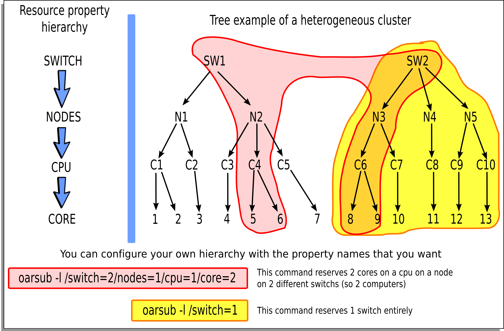

===============================
 OAR Documentation - User Guide
===============================

.. include:: doc_header.rst

:Dedication: For users.

.. include:: doc_abstract.rst

**BE CAREFULL : THIS DOCUMENTATION IS FOR OAR >= 2.3.0**

PDF version : `<OAR-DOCUMENTATION-USER.pdf>`_

.. section-numbering::
.. contents:: Table of Contents

-------------------------------------------------------------------------------

.. include:: doc_oar-presentation.rst

Description of the different commands
=====================================
           
All user commands are installed on cluster login nodes. So you must connect to
one of these computers first.

*oarstat*
---------

This command prints jobs in execution mode on the terminal.

Options
::

  -j, --job                 show informations only for the specified job
  -f, --full                show full informations
  -s, --state               show only the state of a job (optimized query)
  -u, --user                show informations for this user only
      --array               show informations for the specified array_job(s) and
                            toggle array view in
  -c, --compact             prints a single line for array jobs
  -g, --gantt               show job informations between two date-times
  -e, --events              show job events
  -p, --properties          show job properties
      --accounting          show accounting informations between two dates
      --sql                 restricts display by applying the SQL where clause
                            on the table jobs (ex: "project = 'p1'")
      --format              select the text output format. Available values
                            are:
                              - 1
                              - 2
  -D, --dumper              print result in DUMPER format
  -X, --xml                 print result in XML format
  -Y, --yaml                print result in YAML format
  -J, --json                print result in JSON format

Examples
::
            
  # oarstat
  # oarstat -j 42 -f
  # oarstat --sql "project='p1' and state='Waiting'"
  # oarstat -s -j 42

*oarnodes*
----------

This command prints informations about cluster resources (state, which jobs on
which resources, resource properties, ...).

Options
::

 -r, --resource     show the properties of the resource whose id is given as
                    parameter
 -s, --state        show the states of the nodes
 -l, --list         show the nodes list
 -e, --events       show the events recorded for a node either since the date
                    given as parameter or the last 20
     --sql          display resources which matches the SQL where clause
                    (ex: "state = 'Suspected'")
 -D, --dumper       print result in Perl Data::Dumper format
 -X, --xml          print result in XML format
 -Y, --yaml         print result in YAML format
 -J, --json         print result in JSON format

Examples
::

  # oarnodes 
  # oarnodes -s
  # oarnodes --sql "state = 'Suspected'"

*oarsub*
--------

The user can submit a job with this command. So, what is a job in our context?
                  
  A job is defined by needed resources and a script/program to run. So, the user
  must specify how many resources and what kind of them are needed by his
  application. Thus, OAR system will give him or not what he wants and will
  control the execution. When a job is launched, OAR executes user program only
  on the first reservation node. So this program can access some environment
  variables to know its environment:
  ::
                  
    $OAR_NODEFILE                 contains the name of a file which lists
                                  all reserved nodes for this job
    $OAR_JOB_ID                   contains the OAR job identificator
    $OAR_RESOURCE_PROPERTIES_FILE contains the name of a file which lists
                                  all resources and their properties
    $OAR_JOB_NAME                 name of the job given by the "-n" option
    $OAR_PROJECT_NAME             job project name

Options::

 -I, --interactive             Request an interactive job. Open a login shell
                               on the first node of the reservation instead of
                               running a script.
 -C, --connect=<job id>        Connect to a running job
 -l, --resource=<list>         Set the requested resources for the job.
                               The different parameters are resource properties
                               registered in OAR database, and `walltime' which
                               specifies the duration before the job must be 
                               automatically terminated if still running.
                               Walltime format is [hour:mn:sec|hour:mn|hour].
                               Ex: host=4/cpu=1,walltime=2:00:00
     --array <number>          Specify an array job with 'number' subjobs
     --array-param-file <file> Specify an array job on which each subjob will 
                               receive one line of the file as parameter
 -S, --scanscript              Batch mode only: asks oarsub to scan the given
                               script for OAR directives (#OAR -l ...)
 -q, --queue=<queue>           Set the queue to submit the job to
 -p, --property="<list>"       Add constraints to properties for the job.
                               (format is a WHERE clause from the SQL syntax)
 -r, --reservation=<date>      Request a job start time reservation, 
                               instead of a submission. The date format is
                               "YYYY-MM-DD HH:MM:SS".
     --checkpoint=<delay>      Enable the checkpointing for the job. A signal 
                               is sent DELAY seconds before the walltime on
                               the first processus of the job 
     --signal=<#sig>           Specify the signal to use when checkpointing
                               Use signal numbers, default is 12 (SIGUSR2)
 -t, --type=<type>             Specify a specific type (deploy, besteffort,
                               cosystem, checkpoint, timesharing)
 -d, --directory=<dir>         Specify the directory where to launch the
                               command (default is current directory)
     --project=<txt>           Specify a name of a project the job belongs to
 -n, --name=<txt>              Specify an arbitrary name for the job
 -a, --anterior=<job id>       Anterior job that must be terminated to start
                               this new one
     --notify=<txt>            Specify a notification method
                               (mail or command to execute). Ex: 
                                   --notify "mail:name@domain.com"
                                   --notify "exec:/path/to/script args"
     --resubmit=<job id>       Resubmit the given job as a new one
 -k, --use-job-key             Activate the job-key mechanism. 
 -i, --import-job-key-from-file=<file>
                               Import the job-key to use from a files instead
                               of generating a new one.
     --import-job-key-inline=<txt>
                               Import the job-key to use inline instead of 
                               generating a new one.
 -e  --export-job-key-to-file=<file>
                               Export the job key to a file. Warning: the
                               file will be overwritten if it already exists.
                               (the %jobid% pattern is automatically replaced)
 -O  --stdout=<file>           Specify the file that will store the standart
                               output stream of the job.
                               (the %jobid% pattern is automatically replaced)
 -E  --stderr=<file>           Specify the file that will store the standart
                               error stream of the job.
                               (the %jobid% pattern is automatically replaced)
     --hold                    Set the job state into Hold instead of Waiting,
                               so that it is not scheduled (you must run
                               "oarresume" to turn it into the Waiting state)
 -s, --stagein=<dir|tgz>       Set the stagein directory or archive
     --stagein-md5sum=<md5sum> Set the stagein file md5sum
 -D, --dumper                  Print result in DUMPER format
 -X, --xml                     Print result in XML format
 -Y, --yaml                    Print result in YAML format
 -J, --json                    Print result in JSON format

Wanted resources have to be described in a hierarchical manner using the  
"-l" syntax option.

Moreover it is possible to give a specification that must be matched on properties.

So the long and complete syntax is of the form::

    "{ sql1 }/prop1=1/prop2=3+{sql2}/prop3=2/prop4=1/prop5=1+...,walltime=1:00:00"

where:
 - *sql1* : SQL WHERE clause on the table of resources that filters resource
   names used in the hierarchical description
 - *prop1* : first type of resources
 - *prop2* : second type of resources
 - *+* : add another resource hierarchy to the previous one
 - *sql2* : SQL WHERE clause to apply on the second hierarchy request
 - ...

So we want to reserve 3 resources with the same value of the type *prop2* and
with the same property *prop1* and these resources must fit *sql1*. To that
possible resources we want to add 2 others which fit *sql2* and the hierarchy
*/prop3=2/prop4=1/prop5=1*.

   Example of a resource hierarchy and 2 different oarsub commands

`hierarchical_resources.svg <../schemas/hierarchical_resources.svg>`_

Examples
::

  # oarsub -l /nodes=4 test.sh

(the "test.sh" script will be run on 4 entire nodes in the default queue with
the default walltime)
::

  # oarsub --stdout='test12.%jobid%.stdout' --stderr='test12.%jobid%.stderr' -l 
    /nodes=4 test.sh
    ...
    OAR_JOB_ID=702
    ...

(same example than above but here the standard output of "test.sh" will be
written in the file "test12.702.stdout" and the standard error in
"test12.702.stderr")

::

  # oarsub -q default -l /nodes=10/cpu=3,walltime=2:15:00 \
    -p "switch = 'sw1'" /home/users/toto/prog
    
(the "/home/users/toto/prog" script will be run on 10 nodes with 3 cpus (so a
total of 30 cpus) in the default queue with a walltime of  2:15:00.
Moreover "-p" option restricts resources only on the switch 'sw1')
::
     
  # oarsub -r "2009-04-27 11:00:00" -l /nodes=12/cpu=2

(a reservation will begin at "2009-04-27 11:00:00" on 12 nodes with 2 cpus
on each one)
::

  #  oarsub -C 42

(connects to the job 42 on the first node and set all OAR environment
variables)
::

  #  oarsub -p "not host like 'nodename.%'"

(To exclude a node from the request)
::

  # oarsub -I

(gives a shell on a resource)

*oardel*
--------

This command is used to delete or checkpoint job(s). They are designed by
their identifier.

Option
::
  
  -c, --checkpoint        send checkpoint signal to the jobs
  -s, --signal <SIG>      send signal SIG to the jobs
  -b, --besteffort        change the specified jobs to besteffort jobs (or
                          remove them if they are already besteffort)
      --array             handle array job ids, and their sub jobs.
      --sql <SQL>         select jobs using a SQL WHERE clause on table jobs
                          (e.g. "project = 'p1'")
      --force-terminate-finishing-job
                          force jobs stuck in the Finishing state to switch to
                          Terminated (Warning: only use as a last resort)

Examples
::

  # oardel 14 42
    
(delete jobs 14 and 42)
::

  # oardel -c 42

(send checkpoint signal to the job 42)

*oarhold*
---------

This command is used to remove a job from the scheduling queue if it is in
the "Waiting" state.

Moreover if its state is "Running" oarhold_ can suspend the execution and
enable other jobs to use its resources.

Options
::

  -r, --running manage not only Waiting jobs but also Running one
                (can suspend the job)
      --array   hold array job(s) passed as parameter (all the sub-jobs)
      --sql     hold jobs which respond to the SQL where clause on the table
                jobs (ex: "project = 'p1'")

*oarresume*
-----------

This command resumes jobs in the states *Hold* or *Suspended*

Options
::

      --array   resume array job(s) passed as parameter (all the sub-jobs)
      --sql     resume jobs which respond to the SQL where clause on the table
                jobs (ex: "project = 'p1'")

Desktop computing
=================
If you want to compute jobs on nodes without SSH connections then this
feature is for you.

On the nodes you have to run "oar-agent.pl". This script polls the OAR
server via a CGI HTTP script.

Usage examples:
 - if you want to run a program that you know is installed on nodes::

    oarsub -t desktop_computing /path/to/program

   Then /path/to/program is run and the files created in the
   oar-agent.pl running directory is retrieved where oarsub was
   launched.

 - if you want to copy a working environment and then launch the program::

    oarsub -t desktop_computing -s . ./script.sh

   The content of "." is transfred to the node, "./script.sh" is run and
   everything will go back.

Visualisation tools
===================

Monika
------

This is a web cgi normally installed on the cluster frontal. This tool connects
to the DB, gets relevant information then format data in a html page.

Thus you can have a global view of cluster state and where your jobs are
running.

Drawgantt
---------

This is also a web cgi. It creates a Gantt chart which shows job repartition on
nodes in the time. It is very useful to see cluster occupation in the past
and to know when a job will be launched in the future.

.. include:: doc_mechanisms.rst

.. include:: FAQ-USER

.. include:: CHANGELOG
