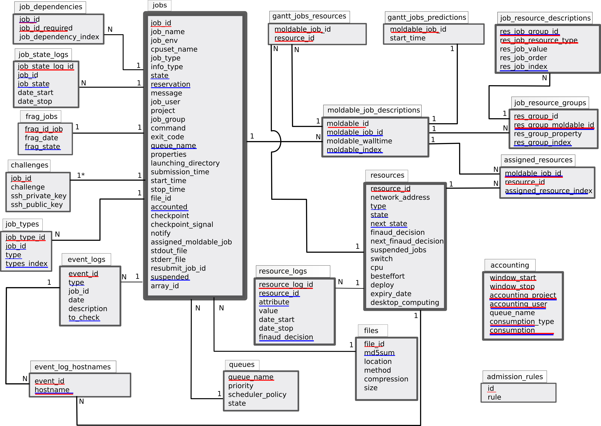

Database scheme
===============

   Database scheme
   (red lines seem PRIMARY KEY,
   blue lines seem INDEX)

Note : all dates and duration are stored in an integer manner (number of
seconds since the EPOCH).

.. _database-accounting-anchor:

accounting
----------

==================  ====================  =======================================
Fields              Types                 Descriptions
==================  ====================  =======================================
window_start        INT UNSIGNED          start date of the accounting interval
window_stop         INT UNSIGNED          stop date of the accounting interval
accounting_user     VARCHAR(20)           user name
accounting_project  VARCHAR(255)          name of the related project
queue_name          VARCHAR(100)          queue name
consumption_type    ENUM("ASKED",         "ASKED" corresponds to the walltimes
                    "USED")               specified by the user. "USED"
                                          corresponds to the effective time
                                          used by the user.
consumption         INT UNSIGNED          number of seconds used
==================  ====================  =======================================

:Primary key: window_start, window_stop, accounting_user, queue_name,
              accounting_project, consumption_type
:Index fields: window_start, window_stop, accounting_user, queue_name,
               accounting_project, consumption_type

This table is a summary of the consumption for each user on each queue. This
increases the speed of queries about user consumptions and statistic
generation.

Data are inserted through the command :doc:`commands/oaraccounting` (when a job is treated
the field *accounted* in table jobs is passed into "YES"). So it is possible to
regenerate this table completely in this way :

 - Delete all data of the table:
   ::

       DELETE FROM accounting;

 - Set the field *accounted* in the table jobs to "NO" for each row:
   ::

       UPDATE jobs SET accounted = "NO";

 - Run the :doc:`commands/oaraccounting` command.

You can change the amount of time for each window : edit the oar configuration
file and change the value of the tag :ref:`ACCOUNTING_WINDOW <ACCOUNTING_WINDOW>`.

.. _database-schema-anchor:

schema
------

================  ====================  =======================================
Fields            Types                 Descriptions
================  ====================  =======================================
version           VARCHAR(255)          database schema version number
name              VARCHAR(255)          optional name
================  ====================  =======================================

This table is used to store the version of the database schema.

So the oar-database command be used to automatically upgrade the schema from
any version with::

    oar-database --setup

.. _database-admission-rules-anchor:

admission_rules
---------------

================  ====================  =======================================
Fields            Types                 Descriptions
================  ====================  =======================================
id                INT UNSIGNED          id number
rule              TEXT                  rule written in Perl applied when a
                                        job is going to be registered
================  ====================  =======================================

:Primary key: id
:Index fields: *None*

You can use these rules to change some values of some properties when a job is
submitted. So each admission rule is executed in the order of the id field and
it can set several variables. If one of them exits then the others will not
be evaluated and oarsub returns an error.

The rules can be added with the following command:
::

    oaradmissionrules -n

Some examples are better than a long description:

 - Specify the default value for queue parameter
   ::

        if (not defined($queue_name)) {
            $queue_name="default";
        }

 - Avoid users except oar to go in the admin queue
   ::

        if (($queue_name eq "admin") && ($user ne "oar")) {
          die("[ADMISSION RULE] Only oar user can submit jobs in the admin queue\n");
        }

 - Restrict the maximum of the walltime for interactive jobs
   ::

        my $max_walltime = OAR::IO::sql_to_duration("12:00:00");
        if ($jobType eq "INTERACTIVE"){
          foreach my $mold (@{$ref_resource_list}){
            if (
              (defined($mold->[1])) and
              ($max_walltime < $mold->[1])
            ){
              print("[ADMISSION RULE] Walltime to big for an INTERACTIVE job so it is set to $max_walltime.\n");
              $mold->[1] = $max_walltime;
            }
          }
        }

 - Specify the default walltime
   ::

      my $default_wall = OAR::IO::sql_to_duration("2:00:00");
      foreach my $mold (@{$ref_resource_list}){
        if (!defined($mold->[1])){
          print("[ADMISSION RULE] Set default walltime to $default_wall.\n");
          $mold->[1] = $default_wall;
        }
      }

 - How to perform actions if the user name is in a file
   ::

      open(FILE, "/tmp/users.txt");
      while (($queue_name ne "admin") and ($_ = <FILE>)){
        if ($_ =~ m/^\\s*$user\\s*$/m){
          print("[ADMISSION RULE] Change assigned queue into admin\n");
          $queue_name = "admin";
        }
      }
      close(FILE);

 - How to automatically add a job type depending of the walltime and an
   estimation of the number of resources of the job
   ::

      foreach my $e (estimate_job_nb_resources($dbh_ro, $ref_resource_list, $jobproperties)){
        #print("AREA: $e->{nbresources} x $e->{walltime} = ".$e->{nbresources} * $e->{walltime}."\n");
        if ($e->{nbresources} * $e->{walltime} > 24*3600*1){
          print("[ADMISSION RULE] Your job is of the 'big' type\n");
          push(@{$type_list},"big");
          last;
        }
      }

You can print all the admission rules with::

    oaradmissionrules -S -f

.. _database-event-logs-anchor:

event_logs
----------

================  ====================  =======================================
Fields            Types                 Descriptions
================  ====================  =======================================
event_id          INT UNSIGNED          event identifier
type              VARCHAR(50)           event type
job_id            INT UNSIGNED          job related of the event
date              INT UNSIGNED          event date
description       VARCHAR(255)          textual description of the event
to_check          ENUM('YES', 'NO')     specify if the module *NodeChangeState*
                                        must check this event to Suspect or not
                                        some nodes
================  ====================  =======================================

:Primary key: event_id
:Index fields: type, to_check

The different event types are:

 - "PING_CHECKER_NODE_SUSPECTED" : the system detected via the module "finaud"
   that a node is not responding.
 - "PROLOGUE_ERROR" : an error occurred during the execution of the job
   prologue (exit code != 0).
 - "EPILOGUE_ERROR" : an error occurred during the execution of the job
   epilogue (exit code != 0).
 - "CANNOT_CREATE_TMP_DIRECTORY" : OAR cannot create the directory where all
   information files will be stored.
 - "CAN_NOT_WRITE_NODE_FILE" : the system was not able to write file which had
   to contain the node list on the first node (*/tmp/OAR_job_id*).
 - "CAN_NOT_WRITE_PID_FILE" : the system was not able to write the file which
   had to contain the pid of oarexec process on the first node
   (*/tmp/pid_of_oarexec_for_job_id*).
 - "USER_SHELL" : the system was not able to get informations about the user
   shell on the first node.
 - "EXIT_VALUE_OAREXEC" : the oarexec process terminated with an unknown exit
   code.
 - "SEND_KILL_JOB" : signal that OAR has transmitted a kill signal to the
   oarexec of the specified job.
 - "LEON_KILL_BIPBIP_TIMEOUT" : Leon module has detected that something wrong
   occurred during the kill of a job and so kill the local *bipbip* process.
 - "EXTERMINATE_JOB" : Leon module has detected that something wrong occurred
   during the kill of a job and so clean the database and terminate the job
   artificially.
 - "WORKING_DIRECTORY" : the directory from which the job was submitted does
   not exist on the node assigned by the system.
 - "OUTPUT_FILES" : OAR cannot write the output files (stdout and stderr) in
   the working directory.
 - "CANNOT_NOTIFY_OARSUB" : OAR cannot notify the `oarsub` process for an
   interactive job (maybe the user has killed this process).
 - "WALLTIME" : the job has reached its walltime.
 - "SCHEDULER_REDUCE_NB_NODES_FOR_RESERVATION" : this means that there is not
   enough nodes for the reservation and so the scheduler do the best and
   gives less nodes than the user wanted (this occurres when nodes become
   Suspected or Absent).
 - "BESTEFFORT_KILL" : the job is of the type *besteffort* and was killed
   because a normal job wanted the nodes.
 - "FRAG_JOB_REQUEST" : someone wants to delete a job.
 - "CHECKPOINT" : the checkpoint signal was sent to the job.
 - "CHECKPOINT_ERROR" : OAR cannot send the signal to the job.
 - "CHECKPOINT_SUCCESS" : system has sent the signal correctly.
 - "SERVER_EPILOGUE_TIMEOUT" : epilogue server script has time outed.
 - "SERVER_EPILOGUE_EXIT_CODE_ERROR" : epilogue server script did not return 0.
 - "SERVER_EPILOGUE_ERROR" : cannot find epilogue server script file.
 - "SERVER_PROLOGUE_TIMEOUT" : prologue server script has time outed.
 - "SERVER_PROLOGUE_EXIT_CODE_ERROR" : prologue server script did not return 0.
 - "SERVER_PROLOGUE_ERROR" : cannot find prologue server script file.
 - "CPUSET_CLEAN_ERROR" : OAR cannot clean correctly cpuset files for a job
   on the remote node.
 - "MAIL_NOTIFICATION_ERROR" : a mail cannot be sent.
 - "USER_MAIL_NOTIFICATION" : user mail notification cannot be performed.
 - "USER_EXEC_NOTIFICATION_ERROR" : user script execution notification cannot
   be performed.
 - "BIPBIP_BAD_JOBID" : error when retrieving informations about a running job.
 - "BIPBIP_CHALLENGE" : OAR is configured to detach jobs when they are launched
   on compute nodes and the job return a bad challenge number.
 - "RESUBMIT_JOB_AUTOMATICALLY" : the job was automatically resubmitted.
 - "WALLTIME" : the job reached its walltime.
 - "REDUCE_RESERVATION_WALLTIME" : the reservation job was shrunk.
 - "SSH_TRANSFER_TIMEOUT" : node OAR part script was too long to transfer.
 - "BAD_HASHTABLE_DUMP" : OAR transfered a bad hashtable.
 - "LAUNCHING_OAREXEC_TIMEOUT" : oarexec was too long to initialize itself.
 - "RESERVATION_NO_NODE" : All nodes were detected as bad for the reservation
   job.

.. _database-event-log-hostnames-anchor:

event_log_hostnames
-------------------

================  ====================  =======================================
Fields            Types                 Descriptions
================  ====================  =======================================
event_id          INT UNSIGNED          event identifier
hostname          VARCHAR(255)          name of the node where the event
                                        has occured
================  ====================  =======================================

:Primary key: event_id
:Index fields: hostname

This table stores hostnames related to events like
"PING_CHECKER_NODE_SUSPECTED".

.. _database-files-anchor:

files
-----

================  ====================  =======================================
Fields            Types                 Descriptions
================  ====================  =======================================
idFile            INT UNSIGNED
md5sum            VARCHAR(255)
location          VARCHAR(255)
method            VARCHAR(255)
compression       VARCHAR(255)
size              INT UNSIGNED
================  ====================  =======================================

:Primary key: idFile
:Index fields: md5sum

.. _database-frag-jobs-anchor:

frag_jobs
---------

================  ==========================  =================================
Fields            Types                       Descriptions
================  ==========================  =================================
frag_id_job       INT UNSIGNED                job id
frag_date         INT UNSIGNED                kill job decision date
frag_state        ENUM('LEON', 'TIMER_ARMED'  state to tell Leon what to do
                  , 'LEON_EXTERMINATE',
                  'FRAGGED')
                  DEFAULT 'LEON'
================  ==========================  =================================

:Primary key: frag_id_job
:Index fields: frag_state

What do these states mean:

 - "LEON" : the Leon module must try to kill the job and change the state into
   "TIMER_ARMED".
 - "TIMER_ARMED" : the Sarko module must wait a response from the job during
   a timeout (default is 60s)
 - "LEON_EXTERMINATE" : the Sarko module has decided that the job time outed and
   asked Leon to clean up the database.
 - "FRAGGED" : job is fragged.

.. _database-gantt-jobs-resources-anchor:

gantt_jobs_resources
--------------------

================  ====================  =======================================
Fields            Types                 Descriptions
================  ====================  =======================================
moldable_job_id   INT UNSIGNED          moldable job id
resource_id       INT UNSIGNED          resource assigned to the job
================  ====================  =======================================

:Primary key: moldable_job_id, resource_id
:Index fields: *None*

This table specifies which resources are attributed to which jobs.

.. _database-gantt-jobs-resources-visu-anchor:

gantt_jobs_resources_visu
-------------------------

================  ====================  =======================================
Fields            Types                 Descriptions
================  ====================  =======================================
moldable_job_id   INT UNSIGNED          moldable job id
resource_id       INT UNSIGNED          resource assigned to the job
================  ====================  =======================================

:Primary key: moldable_job_id, resource_id
:Index fields: *None*

This table is the same as `gantt_jobs_resources`_ and is used by visualisation
tools. It is updated atomically (a lock is used).

.. _database-gantt-jobs-predictions-anchor:

gantt_jobs_predictions
----------------------

================  ====================  =======================================
Fields            Types                 Descriptions
================  ====================  =======================================
moldable_job_id   INT UNSIGNED          job id
start_time        INT UNSIGNED          date when the job is scheduled to start
================  ====================  =======================================

:Primary key: moldable_job_id
:Index fields: *None*

With this table and `gantt_jobs_resources`_ you can know exactly what are the
decisions taken by the schedulers for each waiting jobs.

:note: The special job id "0" is used to store the scheduling reference date.

.. _database-gantt-jobs-predictions-visu-anchor:

gantt_jobs_predictions_visu
---------------------------

================  ====================  =======================================
Fields            Types                 Descriptions
================  ====================  =======================================
moldable_job_id   INT UNSIGNED          job id
start_time        INT UNSIGNED          date when the job is scheduled to start
================  ====================  =======================================

:Primary key: job_id
:Index fields: *None*

This table is the same as `gantt_jobs_predictions`_ and is used by visualisation
tools. It is made up to date in an atomic action (with a lock).

.. _database-jobs-anchor:

jobs
----

===================== ======================  =======================================
Fields                Types                   Descriptions
===================== ======================  =======================================
job_id                INT UNSIGNED            job identifier
array_id              INT                     array identifier
array_index           INT                     index of the job in the array
initial_request       TEXT                    oarsub initial arguments
job_name              VARCHAR(100)            name given by the user
cpuset_name           VARCHAR(255)            name of the cpuset directory used for
                                              this job on each nodes
job_type              ENUM('INTERACTIVE',     specify if the user wants to launch a
                      'PASSIVE') DEFAULT      program or get an interactive shell
                      'PASSIVE'
info_type              VARCHAR(255)           some informations about `oarsub`
                                              command
state                 ENUM('Waiting','Hold',  job state
                      'toLaunch', 'toError',
                      'toAckReservation',
                      'Launching', 'Running'
                      'Suspended',
                      'Resuming',
                      , 'Finishing',
                      'Terminated', 'Error')
reservation           ENUM('None',            specify if the job is a reservation
                      'toSchedule',           and the state of this one
                      'Scheduled') DEFAULT
                      'None'
message               VARCHAR(255)            readable information message for the
                                              user
job_user              VARCHAR(255)             user name
command               TEXT                    program to run
queue_name            VARCHAR(100)            queue name
properties            TEXT                    properties that assigned nodes must
                                              match
launching_directory   TEXT                    path of the directory where to launch
                                              the user process
submission_time       INT UNSIGNED            date when the job was submitted
start_time            INT UNSIGNED            date when the job was launched
stop_time             INT UNSIGNED            date when the job was stopped
file_id               INT UNSIGNED
accounted             ENUM("YES", "NO")       specify if the job was considered by
                      DEFAULT "NO"            the accounting mechanism or not
notify                VARCHAR(255)            gives the way to notify the user about
                                              the job (mail or script )
assigned_moldable_job INT UNSIGNED            moldable job chosen by the scheduler
checkpoint            INT UNSIGNED            number of seconds before the walltime
                                              to send the checkpoint signal to the
                                              job
checkpoint_signal     INT UNSIGNED            signal to use when checkpointing the
                                              job
stdout_file           TEXT                    file name where to redirect program
                                              STDOUT
stderr_file           TEXT                    file name where to redirect program
                                              STDERR

resubmit_job_id       INT UNSIGNED            if a job is resubmitted then the new
                                              one store the previous
project               VARCHAR(255)            arbitrary name given by the user or an
                                              admission rule
suspended             ENUM("YES","NO")        specify if the job was suspended
                                              (oarhold)
job_env               TEXT                    environment variables to set for the
                                              job
exit_code             INT DEFAULT 0           exit code for passive jobs
job_group             VARCHAR(255)            not used
===================== ======================  =======================================

:Primary key: job_id
:Index fields: state, reservation, queue_name, accounted, suspended

Explications about the "state" field:

 - "Waiting" : the job is waiting OAR scheduler decision.
 - "Hold" : user or administrator wants to hold the job (`oarhold` command).
   So it will not be scheduled by the system.
 - "toLaunch" : the OAR scheduler has attributed some nodes to the job. So it
   will be launched.
 - "toError" : something wrong occurred and the job is going into the error
   state.
 - "toAckReservation" : the OAR scheduler must say "YES" or "NO" to the waiting
   `oarsub` command because it requested a reservation.
 - "Launching" : OAR has launched the job and will execute the user command
   on the first node.
 - "Running" : the user command is executing on the first node.
 - "Suspended" : the job was in Running state and there was a request
   (`oarhold` with "-r" option) to suspend this job. In this state other jobs
   can be scheduled on the same resources (these resources has the
   "suspended_jobs" field to "YES").
 - "Finishing" : the user command has terminated and OAR is doing work internally
 - "Terminated" : the job has terminated normally.
 - "Error" : a problem has occurred.

Explications about the "reservation" field:

 - "None" : the job is not a reservation.
 - "toSchedule" : the job is a reservation and must be approved by the
   scheduler.
 - "Scheduled" : the job is a reservation and is scheduled by OAR.

.. _database-job-dependencies-anchor:

job_dependencies
----------------

================  ====================  =======================================
Fields            Types                 Descriptions
================  ====================  =======================================
job_id            INT UNSIGNED          job identifier
job_id_required   INT UNSIGNED          job needed to be completed before
                                        launching job_id
================  ====================  =======================================

:Primary key: job_id, job_id_required
:Index fields: job_id, job_id_required

This table is feeded by `oarsub` command with the "-a" option.

.. _database-moldable-job-descriptions-anchor:

moldable_job_descriptions
-------------------------

=================  ====================  =======================================
Fields             Types                 Descriptions
=================  ====================  =======================================
moldable_id        INT UNSIGNED          moldable job identifier
moldable_job_id    INT UNSIGNED          corresponding job identifier
moldable_walltime  INT UNSIGNED          instance duration
=================  ====================  =======================================

:Primary key: moldable_id
:Index fields: moldable_job_id

A job can be described with several instances. Thus OAR scheduler can choose one
of them. For example it can calculate which instance will finish first.
So this table stores all instances for all jobs.

.. _database-job-resource-groups-anchor:

job_resource_groups
-------------------

===================== ====================  =======================================
Fields                Types                 Descriptions
===================== ====================  =======================================
res_group_id          INT UNSIGNED          group identifier
res_group_moldable_id INT UNSIGNED          corresponding moldable job identifier
res_group_property    TEXT                  SQL constraint properties
===================== ====================  =======================================

:Primary key: res_group_id
:Index fields: res_group_moldable_id

As you can specify job global properties with `oarsub` and the "-p" option,
you can do the same thing for each resource groups that you define with
the "-l" option.

.. _database-job-resource-descriptions-anchor:

job_resource_descriptions
-------------------------

===================== ====================  =======================================
Fields                Types                 Descriptions
===================== ====================  =======================================
res_job_group_id      INT UNSIGNED          corresponding group identifier
res_job_resource_type VARCHAR(255)          resource type (name of a field in
                                            resources)
res_job_value         INT                   wanted resource number
res_job_order         INT UNSIGNED          order of the request
===================== ====================  =======================================

:Primary key: res_job_group_id, res_job_resource_type, res_job_order
:Index fields: res_job_group_id

This table store the hierarchical resource description given with `oarsub` and
the "-l" option.

.. _database-job-state-logs-anchor:

job_state_logs
--------------

=================  ====================  =======================================
Fields             Types                 Descriptions
=================  ====================  =======================================
job_state_log_id   INT UNSIGNED          identifier
job_id             INT UNSIGNED          corresponding job identifier
job_state          ENUM('Waiting',       job state during the interval
                   'Hold', 'toLaunch',
                   'toError',
                   'toAckReservation',
                   'Launching',
                   'Finishing',
                   'Running',
                   'Suspended',
                   'Resuming',
                   'Terminated',
                   'Error')
date_start         INT UNSIGNED          start date of the interval
date_stop          INT UNSIGNED          end date of the interval
=================  ====================  =======================================

:Primary key: job_state_log_id
:Index fields: job_id, job_state

This table keeps informations about state changes of jobs.

.. _database-job-types-anchor:

job_types
---------

================  ====================  =======================================
Fields            Types                 Descriptions
================  ====================  =======================================
job_type_id       INT UNSIGNED          identifier
job_id            INT UNSIGNED          corresponding job identifier
type              VARCHAR(255)          job type like "deploy", "timesharing",
                                        ...
type_index        ENUM('CURRENT',       index field
                  'LOG')
================  ====================  =======================================

:Primary key: job_type_id
:Index fields: job_id, type

This table stores job types given with the `oarsub` command and "-t" options.

.. _database-resources-anchor:

resources
---------

====================  ====================  =======================================
Fields                Types                 Descriptions
====================  ====================  =======================================
resource_id           INT UNSIGNED          resource identifier
type                  VARCHAR(100)          resource type (used for licence
                      DEFAULT "default"     resources for example)
network_address       VARCHAR(100)          node name (used to connect via SSH)
state                 ENUM('Alive', 'Dead'  resource state
                      , 'Suspected',
                      'Absent')
next_state            ENUM('UnChanged',     state for the resource to switch
                      'Alive', 'Dead',
                      'Absent',
                      'Suspected') DEFAULT
                      'UnChanged'
finaud_decision       ENUM('YES', 'NO')     tell if the actual state results in a
                      DEFAULT 'NO'          "finaud" module decision
next_finaud_decision  ENUM('YES', 'NO')     tell if the next node state results in
                      DEFAULT 'NO'          a "finaud" module decision
state_num             INT                   corresponding state number (useful
                                            with the SQL "ORDER" query)
suspended_jobs        ENUM('YES','NO')      specify if there is at least one
                                            suspended job on the resource
scheduler_priority    INT UNSIGNED          arbitrary number given by the system
                                            to select resources with more
                                            intelligence
switch                VARCHAR(50)           name of the switch
cpu                   INT UNSIGNED          global cluster cpu number
cpuset                INT UNSIGNED          field used with the
                                            :ref:`JOB_RESOURCE_MANAGER_PROPERTY_DB_FIELD <JOB_RESOURCE_MANAGER_PROPERTY_DB_FIELD>`
besteffort            ENUM('YES','NO')      accept or not besteffort jobs
deploy                ENUM('YES','NO')      specify if the resource is deployable
expiry_date           INT UNSIGNED          field used for the desktop computing
                                            feature
desktop_computing     ENUM('YES','NO')      tell if it is a desktop computing
                                            resource (with an agent)
last_job_date         INT UNSIGNED          store the date when the resource
                                            was used for the last time
available_upto        INT UNSIGNED          used with compute mode features to
                                            know if an Absent resource can be
                                            switch on
====================  ====================  =======================================

:Primary key: resource_id
:Index fields: state, next_state, type, suspended_jobs

State explications:

 - "Alive" : the resource is ready to accept a job.
 - "Absent" : the oar administrator has decided to pull out the resource. This
   computer can come back.
 - "Suspected" : OAR system has detected a problem on this resource and so has
   suspected it (you can look in the :ref:`database-event-logs-anchor` table to know what has
   happened). This computer can come back (automatically if this is a
   "finaud" module decision).
 - "Dead" : The oar administrator considers that the resource will not come back
   and will be removed from the pool.

This table permits to specify different properties for each resources. These can
be used with the `oarsub` command ("-p" and "-l" options).

You can add your own properties with :doc:`commands/oarproperty` command.

These properties can be updated with the :doc:`commands/oarnodesetting` command ("-p" option).

Several properties are added by default:

 - switch : you have to register the name of the switch where the node is
   plugged.
 - cpu : this is a unique name given to each cpus. This enables OAR scheduler
   to distinguish all cpus.
 - cpuset : this is the name of the cpu on the node. The Linux kernel sets this
   to an integer beginning at 0. This field is linked to the configuration tag
   :ref:`JOB_RESOURCE_MANAGER_PROPERTY_DB_FIELD <JOB_RESOURCE_MANAGER_PROPERTY_DB_FIELD>`.

.. _database-resource-logs-anchor:

resource_logs
-------------

=================  ====================  =======================================
Fields             Types                 Descriptions
=================  ====================  =======================================
resource_log_id    INT UNSIGNED          unique id
resource_id        INT UNSIGNED          resource identifier
attribute          VARCHAR(255)          name of corresponding field in
                                         resources
value              VARCHAR(255)          value of the field
date_start         INT UNSIGNED          interval start date
date_stop          INT UNSIGNED          interval stop date
finaud_decision    ENUM('YES','NO')      store if this is a system change or a
                                         human one
=================  ====================  =======================================

:Primary key: *None*
:Index fields: resource_id, attribute

This table permits to keep a trace of every property changes (consequence of
the :doc:`commands/oarnodesetting` command with the "-p" option).

.. _database-assigned-resources-anchor:

assigned_resources
------------------

================  ====================  =======================================
Fields            Types                 Descriptions
================  ====================  =======================================
moldable_job_id   INT UNSIGNED          job id
resource_id       INT UNSIGNED          resource assigned to the job
================  ====================  =======================================

:Primary key: moldable_job_id, resource_id
:Index fields: moldable_job_id

This table keeps informations for jobs on which resources they were
scheduled.

.. _database-queues-anchor:

queues
------

================  ====================  =======================================
Fields            Types                 Descriptions
================  ====================  =======================================
queue_name        VARCHAR(100)          queue name
priority          INT UNSIGNED          the scheduling priority
scheduler_policy  VARCHAR(100)          path of the associated scheduler
state             ENUM('Active',        permits to stop the scheduling for a
                  'notActive')          queue
                  DEFAULT 'Active'
================  ====================  =======================================

:Primary key: queue_name
:Index fields: *None*

This table contains the schedulers executed by the *oar_meta_scheduler* module.
Executables are launched one after one in the specified priority.

.. _database-challenges-anchor:

challenges
----------

================  ====================  =======================================
Fields            Types                 Descriptions
================  ====================  =======================================
job_id            INT UNSIGNED          job identifier
challenge         VARCHAR(255)          challenge string
ssh_private_key   TEXT DEFAULT NULL     ssh private key given by the user
                                        (in grid usage it enables to connect
                                        onto all nodes of the job of all
                                        clusers with oarsh)
ssh_public_key    TEXT DEFAULT NULL     ssh public key
================  ====================  =======================================

:Primary key: job_id
:Index fields: *None*

This table is used to share a secret between OAR server and oarexec process on
computing nodes (avoid a job id being stolen/forged by malicious user).

For security reasons, this table **must not be readable** for a database
account given to users who want to access OAR internal informations(like statistics).
